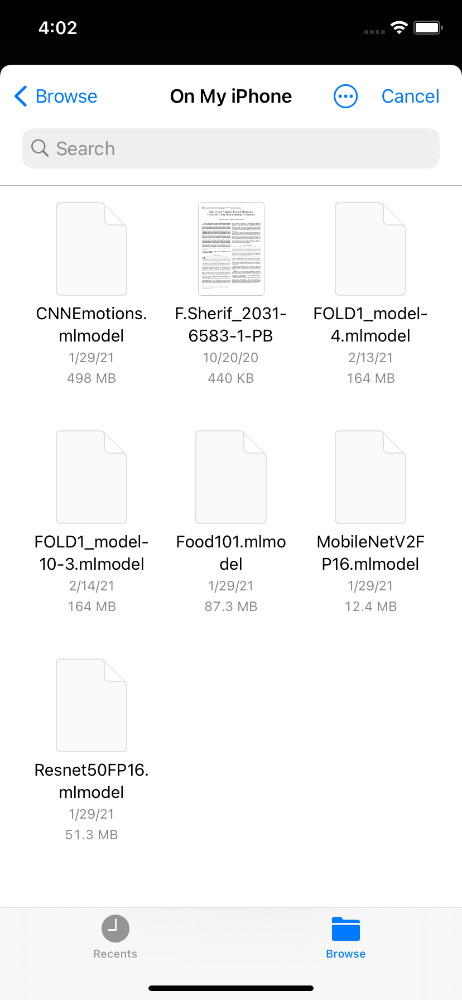
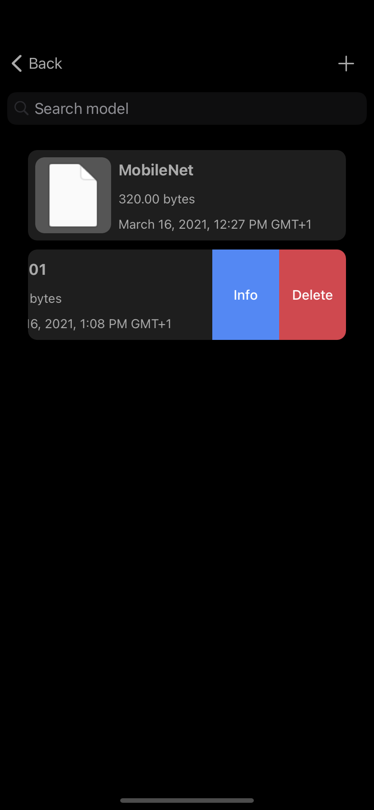
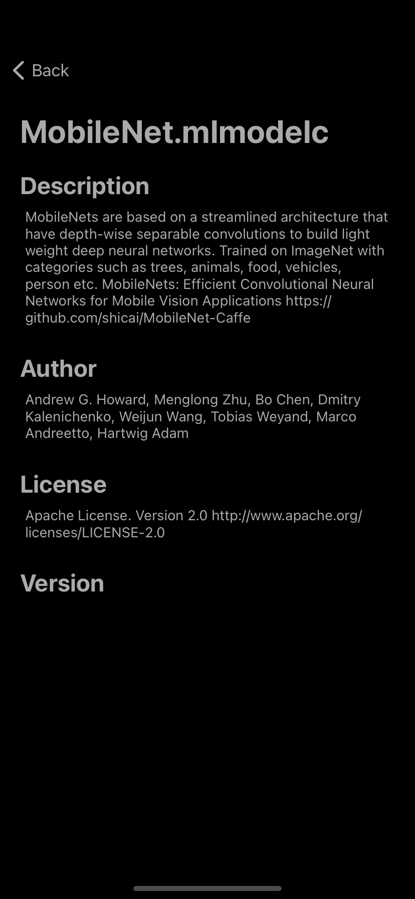
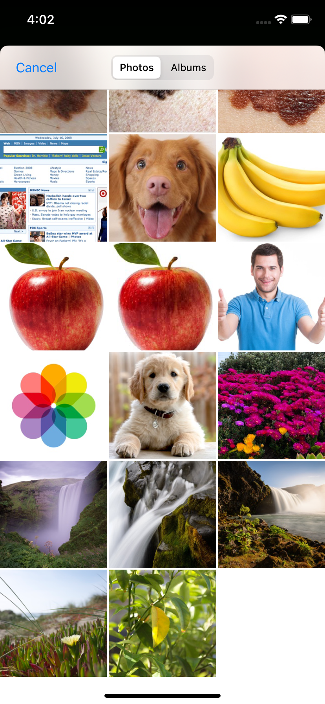
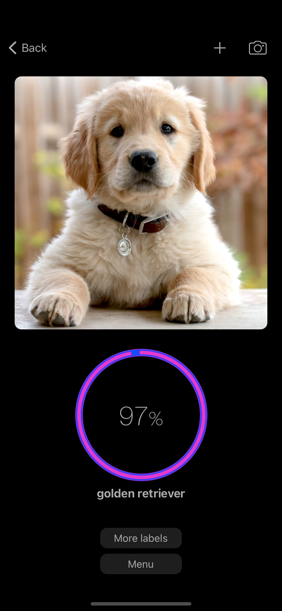
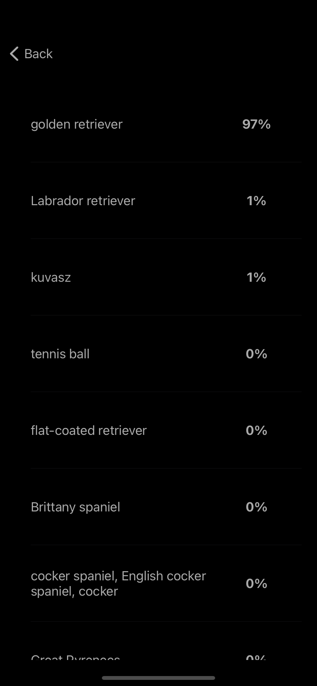

# ImageClassifier

## Technologies

## Runtime environment

 
 
 
 

## Table of contents
* [General info](#general-info)
* [Functionality](#functionality)
* [Demo](#demo)
* [Sources](#sources)
* [Contact](#contact)

## General info
This project is simple iOS app using CoreML framework to predict object class on the photo

## Functionality

The application can load models from the device memory and compile them to .mlmodelc formats. The loaded models can be viewed in the form of a list and searched by keywords. Using the swipe left gesture you can delete the loaded model or read its metadata (author, general info, version ...)

 
		   
                    

		   
After selecting the model, you can load a photo from your camera roll or take a new one. The result of the prediction is presented in terms of probability and class name. You can view the probability of belonging to other classes included in the model

 
		   
                    

## Demo

  

## Sources
* Swipe gesture: https://github.com/SwipeCellKit/SwipeCellKit
* Prediction as circular progress bar: https://github.com/MatiBot/MBCircularProgressBar

## Contact

